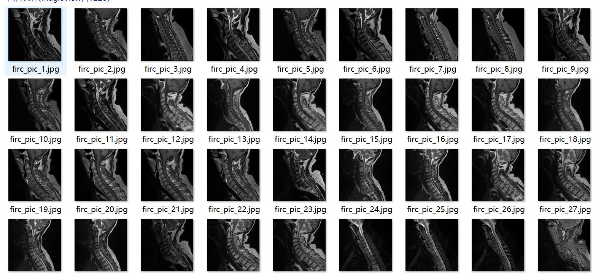
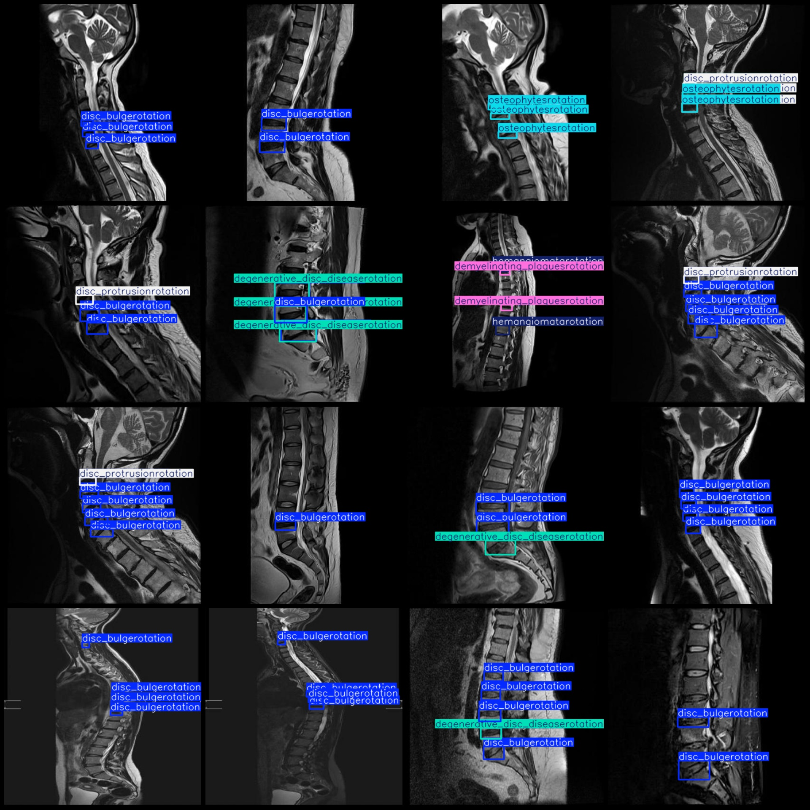
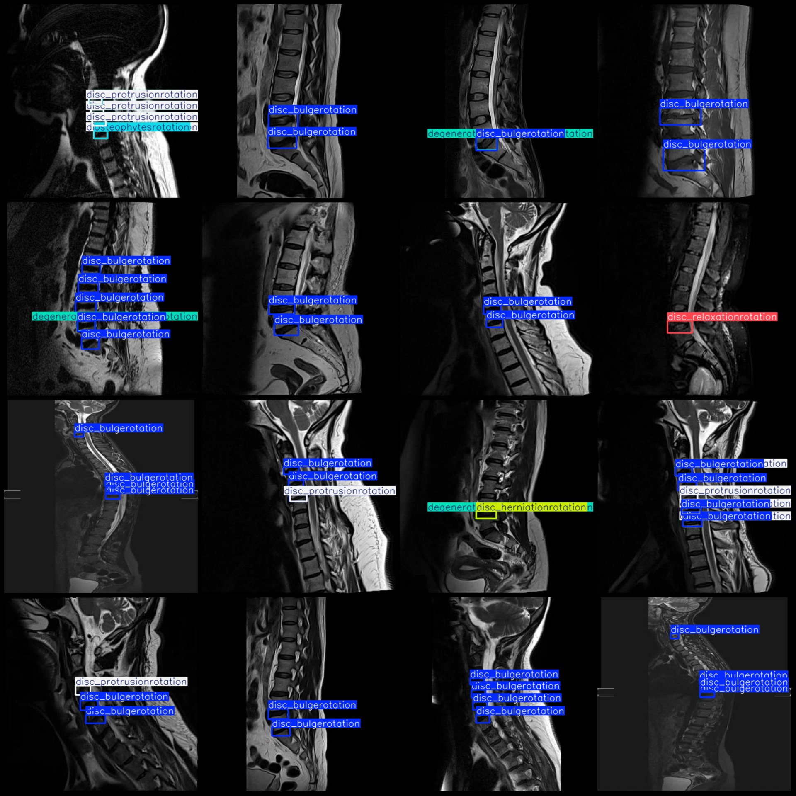

# Smart Health Spinal Disease Detection Dataset VOC+YOLO format, 1228 images, 11 classes

Please note the low resolution of the image.
The dataset format: Pascal VOC format + YOLO format (the txt file does not contain the split path, only contains jpg images and corresponding VOC format xml files and yolo format txt files)
Number of image files (JPG): 1228
Number of annotation files (XML): 1228
Number of annotation files (TXT): 1228
Number of annotation categories: 11
Annotation category names (notice the order of categories in the yolo format is different from this, but follow the order in the labels folder classes.txt): ["annular_disc_relaxationrotation", "annular_tearrotation", "degenerative_disc_diseaserotation", "demyelinating_plaquesrotation", "disc_bulgerotation", "disc_herniationrotation", "disc_protrusionrotation", "disc_relaxationrotation", "fracturerotation", "hemangiomatarotation", "osteophytesrotation"]
Number of bounding boxes per category:
annular_disc_relaxationrotation (disk herniation) = 122
annular_tearrotation (disk tear) = 95
degenerative_disc_diseaserotation (degenerative disc disease) = 441
demyelinating_plaquesrotation (demyelinating plaques) = 126
disc_bulgerotation (disk herniation) = 2088
disc_herniationrotation (disk herniation) = 110
disc_protrusionrotation (disk protrusion) = 591
Disc Relaxation and Rotation (124 boxes)
Fracture (12 boxes)
Hemangioma (126 boxes)
Osteophyte Rotation (412 boxes)
total boxes: 4247  
images per class:   
Annular disc relaxation rotation: images = 64
Annular disc tear rotation: images = 84
Degenerative disc disease rotation: images = 265
Deminerve plaques rotation: images = 63
Discbulger rotation: images = 879
Disc herniation rotation: images = 66
Disc protrusion rotation: images = 291
Disc relaxation rotation: images = 64
Fracture rotation: images = 12
Hemangiomata rotation: images = 63
Osteophytes rotation: images = 174
image resolution: 416x416  
Annotation Tool: labelImg
Annotation Rules: Draw a rectangular box around the class.
Important Notes: The dataset does not have a division of training, validation, and test sets. You need to divide them yourself.
Special Statement: This dataset does not guarantee the accuracy of the trained model or weight files.
Image Preview:
## Images

Here is a pay link on Stripe ( https://buy.stripe.com/3cs8yP7sY87d0vu9AB ). Please contact me lonlonago@foxmail.com after funding $89, and I will send you a complete data files , thank you!

